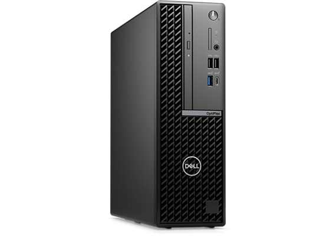
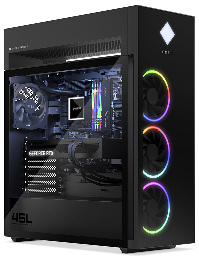
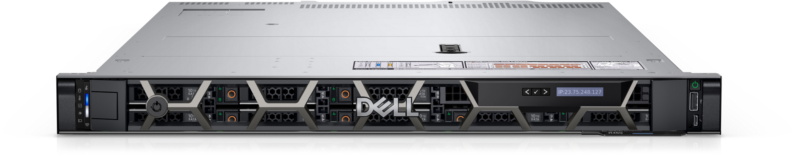
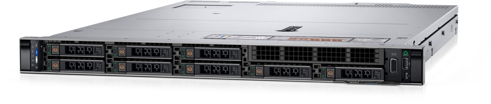

# Memoria Técnica de Hardware - Proyecto Intermodular ASIR

## 1. Análisis de Necesidades y Dimensionamiento

La empresa para la que he diseñado esta infraestructura es una empresa de desarrollo de software. Tiene 20 empleados repartidos en varios departamentos: desarrollo (8 personas), administración (3), dirección (2), soporte (3), formación (2) e infraestructura IT (2).

No todos los departamentos tienen las mismas necesidades. Los de desarrollo e IT necesitan equipos potentes porque trabajan con máquinas virtuales, contenedores Docker y compilación de código. En cambio, los departamentos de administración, dirección, soporte y formación pueden trabajar con equipos más sencillos, siempre que sean estables y rápidos para el día a día.

Por eso he definido dos perfiles de hardware distintos, además de un servidor central que se encarga de gestionar los servicios comunes como usuarios, archivos y bases de datos.

---

### 1.1 Inventario de Equipos

| Tipo de Equipo | Cantidad | Destino |
|:---|:---:|:---|
| Alto Rendimiento | 10 | Desarrollo (8) + Infraestructura IT (2) |
| Perfil Medio | 10 | Administración (3), Dirección (2), Soporte (3), Formación (2) |
| Servidor Rack | 1 | CPD (Centro de Procesamiento de Datos) |

---

### 1.2 Perfil de Alto Rendimiento (Desarrollo e IT)

Para los equipos de desarrollo y del departamento IT he elegido el **HP OMEN 45L**. Es un equipo pensado para cargas de trabajo exigentes.

| Componente | Especificación | Por qué lo he elegido |
|:---|:---|:---|
| CPU | Intel Core i9-14900K | Tiene 24 núcleos, lo que permite ejecutar varias tareas pesadas a la vez, como compilar código, levantar contenedores Docker o ejecutar máquinas virtuales. |
| Placa Base | Chipset Z790 | Es la que mejor aprovecha el procesador y soporta tecnologías como PCIe 5.0. Además, permite ampliar componentes en el futuro. |
| RAM | 64 GB DDR5 | Con 64 GB hay suficiente para tener varios entornos abiertos sin que el equipo se ralentice. |
| Almacenamiento | 2 TB SSD NVMe | Un SSD de este tipo es mucho más rápido que un disco duro tradicional. Los proyectos grandes se cargan en segundos y las compilaciones se notan más rápidas. |
| GPU | RTX 4070 | No todos los desarrolladores la necesitan, pero en algunos proyectos (como juegos o aplicaciones con gráficos) viene bien tener una tarjeta gráfica potente. |
| Refrigeración | Líquida 360 mm | El procesador calienta bastante cuando se usa al máximo. Con refrigeración líquida evito que baje el rendimiento por temperatura. |
| Fuente | 850W 80 Plus Gold | Una fuente de 850W con certificación Gold garantiza que todos los componentes reciban energía estable y con buen rendimiento energético. |

---

### 1.3 Perfil Medio (Administración y Gestión)

Para los puestos de administración, dirección, soporte y formación he elegido el **Dell OptiPlex 7020 SFF**. Es un equipo compacto y fiable.

| Componente | Especificación | Por qué lo he elegido |
|:---|:---|:---|
| CPU | Intel Core i5-14500 | Es un procesador equilibrado. Tiene 14 núcleos, que son más que suficientes para ofimática, navegación web y aplicaciones de gestión. |
| Placa Base | Chipset Q670 | Es una placa pensada para entornos profesionales. Ofrece estabilidad y opciones de gestión remota. |
| RAM | 16 GB DDR5 | Con 16 GB se puede trabajar con varias aplicaciones abiertas a la vez sin problemas. |
| Almacenamiento | 512 GB SSD NVMe | El SSD hace que el sistema arranque rápido y que los programas se abran sin esperas. |
| Formato | SFF (Small Form Factor) | Ocupa muy poco espacio, ideal para oficinas donde la mesa puede ser pequeña. |
| Fuente | 260W 80 Plus Platinum | Es una fuente eficiente y suficiente para este tipo de equipo. |

---

### 1.4 Servidor (CPD)

El servidor es el núcleo de la infraestructura. Centraliza los usuarios (con Active Directory), las bases de datos, los archivos compartidos y otros servicios internos.

He elegido un **Dell PowerEdge R450** por su fiabilidad y porque es un modelo bastante estándar en entornos de empresa.

| Componente | Especificación | Por qué lo he elegido |
|:---|:---|:---|
| CPU | 2x Intel Xeon Silver 4309Y | Estos procesadores están diseñados para funcionar 24/7 sin problemas. Al tener dos, el servidor puede gestionar varios servicios a la vez sin saturarse. |
| RAM | 32 GB DDR4 ECC (4x8 GB, ampliable a 128 GB) | La memoria ECC corrige errores automáticamente. En un servidor esto es importante para evitar fallos que puedan afectar a los datos. |
| Almacenamiento SO | 2x 480 GB SSD SATA en RAID 1 | El sistema operativo está duplicado en dos discos. Si uno falla, el otro sigue funcionando y el servidor no se cae. |
| Almacenamiento Datos | 4x 2 TB HDD SAS en RAID 10 | Para los datos de la empresa he usado cuatro discos SAS en RAID 10. Así consigo buen rendimiento y tolerancia a fallos: puede fallar hasta dos discos sin perder información. |
| Controladora RAID | PERC H755 con 8 GB de caché | Esta controladora gestiona los discos y mejora el rendimiento. La caché ayuda a acelerar las operaciones de lectura y escritura. |
| Red | 2x NIC 1GbE | Tiene dos puertos de red por si quiero separar tráfico o hacer agregación de enlaces. |
| Fuente | 2x 800W redundantes | Las dos fuentes son redundantes. Si una falla, la otra sigue funcionando sin que el servidor se apague. |

---

### 1.5 Sistema de Almacenamiento

El almacenamiento es uno de los puntos críticos. He intentado equilibrar velocidad, capacidad y seguridad según el uso de cada equipo.

| Elemento | Especificación | Por qué lo he elegido |
|:---|:---|:---|
| SSD NVMe | 2 TB en desarrollo / 512 GB en administración | Los SSD NVMe son muy rápidos. En desarrollo ayudan a cargar proyectos grandes en segundos; en administración hacen que el sistema responda de forma ágil. |
| HDD SAS | 4x 2 TB en servidor (RAID 10) | Para los datos del servidor he usado discos SAS. Son más fiables que los discos normales y ofrecen buena capacidad de almacenamiento (8 TB brutos, 4 TB útiles en RAID 10). |
| RAID 1 | 2x 480 GB SSD en servidor | El sistema operativo está duplicado. Si un disco se estropea, el servidor sigue arrancando con el otro. |
| RAID 10 | 4x 2 TB HDD en servidor | Combina rendimiento y redundancia. Pueden fallar hasta dos discos sin que se pierdan datos, y la velocidad de lectura/escritura es mejor que con RAID 1 o RAID 5. |
| Backup externo | 1 disco externo 8 TB USB-C | Hago copias de seguridad semanales en un disco externo. Lo guardo en un sitio diferente al servidor por si ocurre algún problema grave. |
| SAI | 2 unidades APC Smart-UPS 1500VA | Los SAI protegen los equipos de cortes de luz y subidas de tensión. Permiten apagar los sistemas de forma controlada si se va la luz, evitando pérdida de datos. |

---

### 1.6 Periféricos

Los periféricos también son importantes para que los empleados trabajen cómodos y sean productivos.

| Elemento | Cantidad | Especificación | Por qué lo he elegido |
|:---|:---:|:---|:---|
| Monitor | 20 | 27" QHD IPS | La resolución QHD permite tener varias ventanas abiertas a la vez. En desarrollo es muy útil para tener el código, la terminal y el navegador visibles sin cambiar de pantalla. |
| Monitor adicional | 10 | 24" FHD IPS | Para los puestos de desarrollo y soporte he añadido un segundo monitor. Con dos pantallas se trabaja más cómodo: por ejemplo, código en una y documentación en la otra. |
| Teclado + ratón | 20 | Inalámbrico con reposamuñecas | Los he elegido inalámbricos para evitar cables en la mesa. El diseño ergonómico ayuda a reducir la fatiga en jornadas largas. |
| Auriculares | 15 | Con micrófono y cancelación de ruido | Los necesitan sobre todo desarrollo y soporte para reuniones virtuales y atención a clientes. La cancelación de ruido mejora la calidad de las llamadas. |
| Webcam | 15 | 1080p | Aunque algunos equipos llevan cámara, estas externas dan mejor calidad de imagen para videollamadas profesionales. |

---

### 1.7 Evolución del Sistema

He intentado elegir componentes que permitan ampliar la infraestructura sin tener que cambiar todo cuando la empresa crezca. Las mejoras que tengo en mente son:

- **Segundo servidor**: si la empresa llega a los 50 empleados, añadiría otro servidor igual para montar un cluster de alta disponibilidad. Así, si uno falla, los servicios pasan al otro sin que los usuarios noten nada.

- **Ampliar RAM**: los equipos de desarrollo pueden ampliarse hasta 128 GB de RAM sin cambiar la placa base. Esto permite afrontar proyectos más grandes sin tener que renovar los ordenadores.

- **Almacenamiento en red (NAS)**: incorporaría una NAS con varios discos en RAID 6 para centralizar las copias de seguridad y liberar espacio en el servidor principal.

- **Cloud híbrido**: para picos de trabajo o proyectos puntuales, se podrían desplegar entornos de desarrollo temporales en la nube (AWS o Azure), complementando la infraestructura local.

Con estas mejoras el sistema se puede adaptar a las necesidades de la empresa sin tener que rediseñarlo desde cero.

---

## 2. Presupuesto

He buscado precios de proveedores habituales como PcComponentes, Amazon y la tienda oficial de Dell. Los precios son aproximados, basados en configuraciones reales del mercado en 2025-2026.

| Equipo | Proveedor | Cantidad | Precio Unitario | Total |
|:---|:---|:---:|:---:|:---:|
| HP OMEN 45L | HP / PcComponentes | 10 | 3.999 € | 39.990 € |
| Dell OptiPlex 7020 | Dell / Amazon | 10 | 739 € | 7.390 € |
| Dell PowerEdge R450 | Dell | 1 | 3.856,88 € | 3.856,88 € |
| SAI 1500VA | APC / Amazon | 2 | 850 € | 1.700 € |
| Disco externo 8TB | Amazon / PcComponentes | 1 | 189 € | 189 € |
| **TOTAL** | | | | **53.125,88 €** |

Los precios pueden variar según proveedor y disponibilidad en el momento de la compra

---

## 3. Equipos utilizados

He incluido algunas imágenes de referencia para que se vean los equipos que he seleccionado.

### PC Administración

### PC Desarrollo

### Servidor

---

## 4. Conclusión

Después de hacer el análisis de necesidades y de buscar componentes, creo que esta configuración es adecuada para la empresa:

- Los equipos de desarrollo e IT tienen potencia suficiente para trabajar con máquinas virtuales, contenedores y compilaciones pesadas.
- Los equipos de administración, dirección, soporte y formación son rápidos y estables para el trabajo diario.
- El servidor centraliza los servicios importantes y está preparado para funcionar sin interrupciones gracias al RAID y a las fuentes redundantes.
- El sistema se puede ampliar sin demasiados problemas si la empresa crece.

He intentado buscar un equilibrio entre rendimiento, fiabilidad y coste, pensando en que la inversión sea razonable pero que los equipos duren varios años sin quedarse obsoletos.
