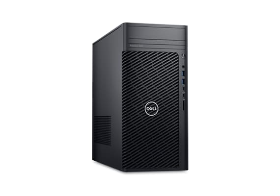
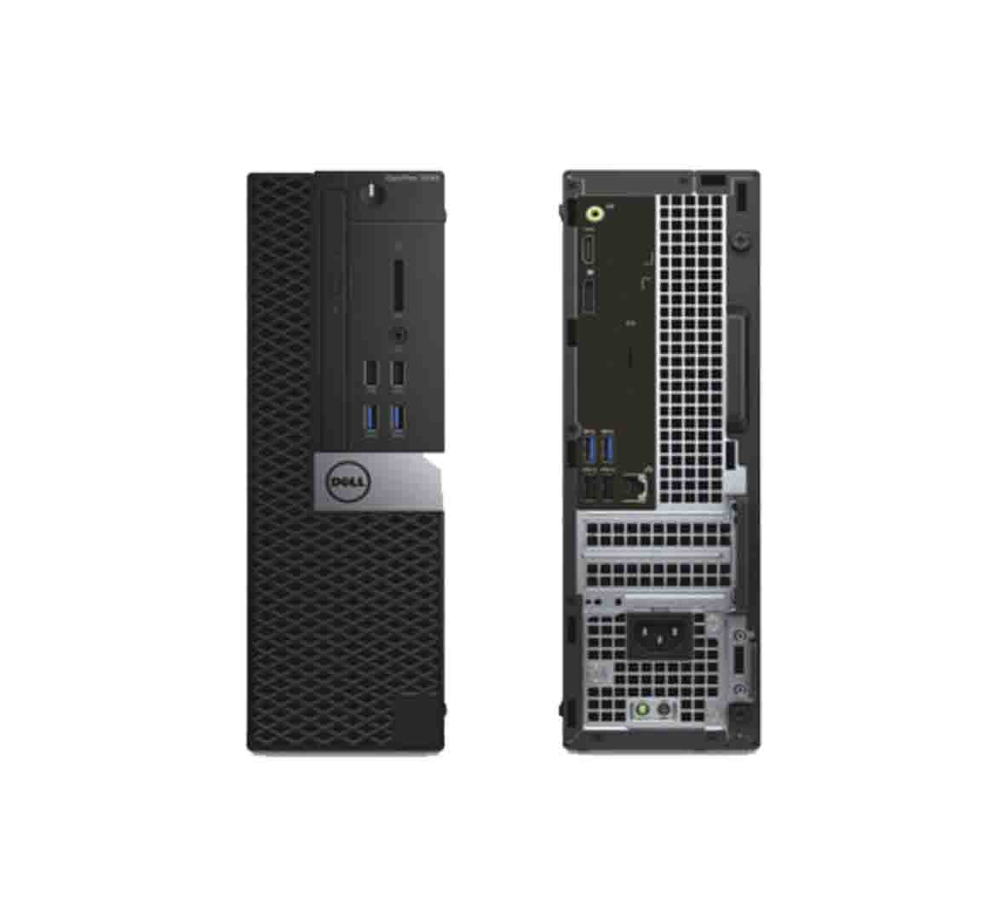
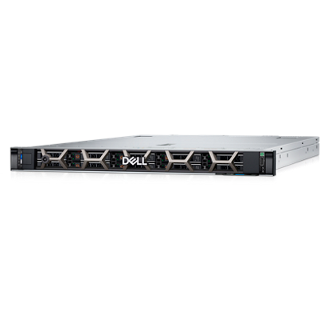
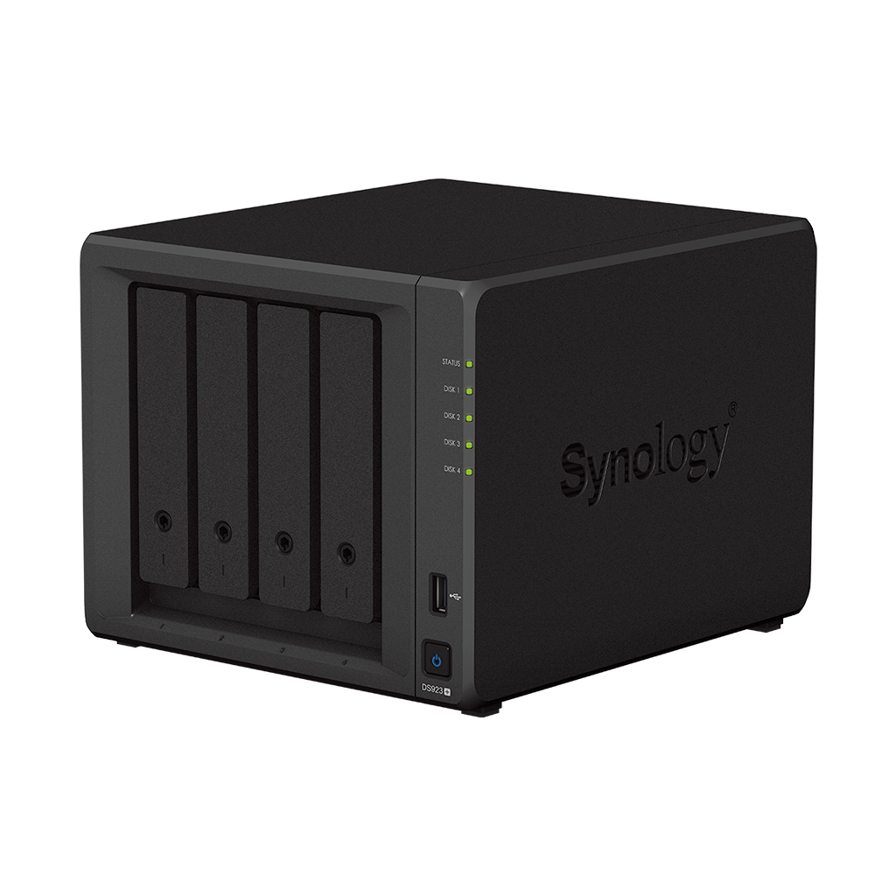
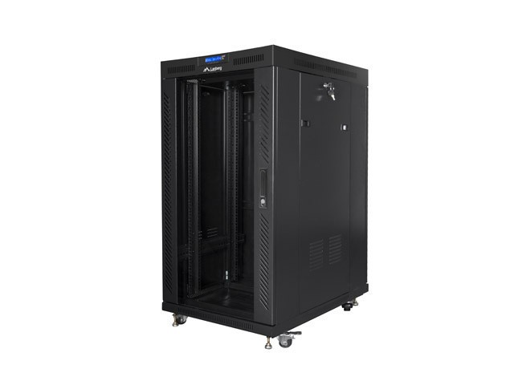

# 📄 MEMORIA TÉCNICA DE HARDWARE  
**Proyecto Intermodular ASIR**

---

## 📑 Índice

1. Introducción  
2. Análisis de necesidades  
3. Dimensionamiento de la infraestructura  
4. Equipos cliente  
 4.1 Equipos de alto rendimiento  
 4.2 Equipos de perfil medio  
5. Servidor del CPD  
6. Componentes hardware explicados  
7. Justificación de la elección del hardware  
8. Explicación técnica de las placas base  
9. Almacenamiento y copias de seguridad  
10. Equipamiento del CPD  
11. Equipamiento de red  
12. Presupuesto detallado  
13. Evidencias de compra  
14. Limitaciones de la solución  
15. Conclusión  

---

## 1. Introducción

Este documento define y justifica el hardware necesario para la infraestructura IT de una empresa de desarrollo de software simulada en el Proyecto Intermodular ASIR.

La empresa requiere una infraestructura capaz de soportar:

- Entornos de desarrollo  
- Virtualización  
- Almacenamiento de datos  
- Servicios internos accesibles desde la red  

El diseño se basa en un **CPD centralizado con virtualización (Proxmox)**, equipos cliente diferenciados por perfil y una red segmentada mediante VLANs.

---

## 2. Análisis de necesidades

La empresa cuenta con **20 empleados**:

| Tipo de usuario | Necesidad |
|----------------|----------|
| Desarrollo / IT | Virtualización, compilación |
| Administración | Ofimática |
| Dirección | Gestión |
| Soporte | Herramientas técnicas |
| Formación | Uso general |

---

## 3. Dimensionamiento de la infraestructura

| Tipo | Cantidad | Uso |
|------|--------|-----|
| Alto rendimiento | 10 | Desarrollo + IT |
| Perfil medio | 10 | Resto |
| Servidor | 1 | CPD |

---

## 4. Equipos cliente

### 4.1 Equipos de alto rendimiento (Workstations)

**Configuración:**

- CPU: Intel Core i9-14900K  
- RAM: 64 GB DDR5  
- SSD: 2 TB NVMe  
- GPU: NVIDIA RTX 4070  

💰 Precio estimado: 2.400 – 2.800 €

**Justificación:**  
Equipos destinados a desarrollo e IT, preparados para virtualización, compilación de software y uso de contenedores.

---

### 4.2 Equipos de perfil medio (Oficina)

**Configuración:**

- CPU: Intel Core i5-14500  
- RAM: 16 GB DDR5  
- SSD: 512 GB NVMe  
- Formato: SFF  

💰 Precio estimado: 700 – 900 €

**Justificación:**  
Adecuados para tareas de ofimática, navegación y software empresarial.

---

## 5. Servidor del CPD

**Configuración:**

- CPU: 2× Intel Xeon Silver  
- RAM: 128 GB ECC  
- SO: 2× SSD 480 GB (RAID 1)  
- Datos: 4× SAS 2 TB (RAID 10)  
- Red: 2× 1 GbE  
- Fuente: Redundante  

💰 Precio estimado: 6.000 – 8.000 €

**Justificación:**  
Servidor encargado de la virtualización mediante Proxmox y de alojar servicios críticos como DNS, DHCP, web y copias de seguridad.

En un entorno real, se implementaría un cluster para alta disponibilidad.

---

## 6. Componentes hardware explicados

**CPU:**  
Ejecuta instrucciones y procesos. Más núcleos y multihilo mejoran el rendimiento en virtualización.

**RAM:**  
Determina el número de máquinas virtuales simultáneas. La memoria ECC evita errores en servidores.

**Almacenamiento:**  
SSD NVMe proporciona alta velocidad. SAS ofrece mayor fiabilidad en servidores.

**RAID:**  
- RAID 1 → redundancia  
- RAID 10 → combinación de rendimiento y seguridad  

---

## 7. Justificación de la elección del hardware

- Alto rendimiento para desarrollo  
- Fiabilidad en el servidor (ECC, RAID, redundancia)  
- Escalabilidad futura  
- Integración con la red (VLAN 60 para servidores)  
- Optimización de costes  

---

## 8. Explicación técnica de las placas base

**Z790 (alto rendimiento):**
- Soporte DDR5  
- PCIe 5.0  
- Múltiples NVMe  

**Q670 (oficina):**
- Intel vPro  
- TPM 2.0  
- Alta estabilidad  

**Servidor (PowerEdge):**
- RAM ECC  
- RAID  
- iDRAC  
- Redundancia  

---

## 9. Almacenamiento y copias de seguridad

Se aplica la estrategia **3-2-1**:

- 3 copias de los datos  
- 2 soportes distintos  
- 1 copia externa  

Incluye:

- Servidor de backup  
- NAS dedicado  
- Copia externa periódica  

---

## 10. Equipamiento del CPD

| Elemento | Función |
|---------|--------|
| Rack 19" | Organización |
| SAI | Protección eléctrica |
| NAS | Copias de seguridad |

En un entorno real se incluiría climatización.

---

## 11. Equipamiento de red

| Dispositivo | Modelo |
|------------|--------|
| Router | Cisco 2911 |
| Switches | Cisco 2960 |
| AP | Empresarial |

El uso de Cisco es coherente con el entorno de simulación en Packet Tracer.

---

## 12. Presupuesto detallado

| Equipo | Cantidad | Precio | Total |
|--------|----------|--------|-------|
| Workstations | 10 | 2.500 € | 25.000 € |
| PCs oficina | 10 | 800 € | 8.000 € |
| Servidor | 1 | 7.000 € | 7.000 € |
| NAS | 1 | 700 € | 700 € |
| SAI | 2 | 800 € | 1.600 € |

👉 **Total estimado: 42.300 €**

---

## 13. Evidencias de compra

Precios basados en configuraciones reales de:

- Dell Precision / PowerEdge  
- HP Enterprise  
- PcComponentes  
- Amazon  

Ejemplos:

- Workstations → 2.400–2.800 €  
- PCs → 700–900 €  
- Servidores → desde 6.000 €  

Se han consultado configuradores oficiales para obtener valores realistas.

---

## 14. Limitaciones de la solución

- Un único servidor (punto de fallo)  
- Red de 1 GbE  
- Sin alta disponibilidad  

Soluciones en entorno real:

- Cluster Proxmox  
- Red 10 GbE  
- Almacenamiento distribuido  

---

## 15. Conclusión

La infraestructura propuesta:

- Se adapta a las necesidades reales  
- Está correctamente dimensionada  
- Permite crecimiento futuro  
- Garantiza estabilidad en el CPD  
- Mantiene equilibrio coste/rendimiento  

Además, se integra correctamente con la red y los sistemas, formando una solución completa, coherente y profesional.
