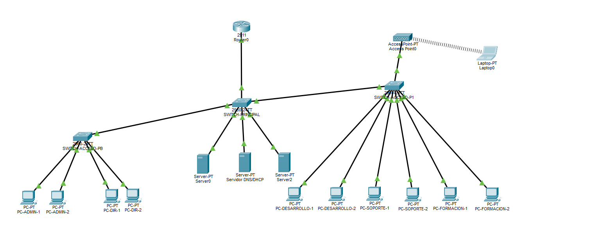

## 2. Diseño de la topología de red

### 2.1 Tipo de topología
Se ha elegido una topología jerárquica, ya que es la más utilizada en entornos empresariales.

Esta topología se divide en:

- Capa de acceso (switches por planta)  
- Capa de distribución (switch principal capa 2)
- Capa de salida (router)  

---

### 2.2 Distribución de la red
La red se organiza en dos plantas:

**Planta baja**
- Switch de acceso PB  
- Equipos de Administración y Dirección  
- Sala de servidores (CPD)  

**Primera planta**
- Switch de acceso P1  
- Equipos de Desarrollo, Soporte técnico y Aula de formación  

---

### 2.3 Dispositivos utilizados
La red estará formada por:

- 1 Router (salida a Internet)  
- 1 Switch principal  
- 2 Switches de acceso (uno por planta)  
- 1 Punto de acceso WiFi  
- 3 Servidores  
- 20 PCs (representados de forma agrupada en el diagrama)  

---

### 2.4 Conexiones de red
Los PCs se conectan a los switches de acceso mediante enlaces de tipo access.

Los switches de acceso se conectan al switch principal mediante enlaces troncales (trunk).

El switch principal se conecta al router.

El punto de acceso se conecta a un switch de acceso.

Los servidores se conectan al switch principal.

---

### 2.5 Conexión a Internet y enrutamiento

El router actúa como gateway de la red, proporcionando salida a Internet mediante NAT.

Además, se encarga del enrutamiento entre VLANs utilizando la técnica router-on-a-stick, mediante subinterfaces asociadas a cada VLAN.

Se conecta al proveedor de servicios (ISP) mediante una interfaz WAN, permitiendo el acceso a recursos externos.

---

### 2.6 Segmentación de red (VLANs)

Para organizar la red y mejorar la seguridad, se utilizarán las siguientes VLANs:

| VLAN | Nombre     | Departamento     | Red IP              |
|------|------------|------------------|---------------------|
| 10   | ADMIN      | Administración   | 192.168.10.0/24     |
| 20   | DIR        | Dirección        | 192.168.20.0/24     |
| 30   | DEV        | Desarrollo       | 192.168.30.0/24     |
| 40   | SOPORTE    | Soporte técnico  | 192.168.40.0/24     |
| 50   | FORMACION  | Aula formación   | 192.168.50.0/24     |
| 60   | SRV        | Servidores       | 192.168.60.0/24     |
| 99   | MGMT       | Gestión          | 192.168.99.0/24     |

---

### 2.7 Tipos de enlaces

En la red se utilizarán dos tipos de enlaces:

**Enlaces troncales (trunk):**  
Se utilizan entre switches. Permiten transportar múltiples VLANs mediante el protocolo 802.1Q.

**Enlaces de acceso (access):**  
Se utilizan para conectar dispositivos finales como PCs, servidores y puntos de acceso. Cada puerto pertenece a una única VLAN.

---

### 2.8 Justificación del diseño

La utilización de una topología jerárquica permite organizar la red de forma clara y facilitar su ampliación en el futuro.

El uso de VLANs mejora la seguridad y reduce el tráfico innecesario dentro de la red.

La separación en capas facilita la administración, mantenimiento y resolución de problemas.

---

### 2.9 Diagramas de la topología

A continuación se muestran los diagramas de la red:

**Diagrama lógico (diseño):**

**Topología en Cisco Packet Tracer (implementación):**

---

### 2.10 Cableado físico en Packet Tracer

El cableado de la red se ha realizado utilizando cables Copper Straight-Through.

Las conexiones principales son:

- Router (G0/0) → Switch Principal (G0/1)  
- Switch Principal (G0/2) → Switch Acceso PB (G0/1)  
- Switch Principal (Fa0/1) → Switch Acceso P1 (G0/1)  

**Servidores:**
- Server0 → Fa0/21  
- Server1 → Fa0/22  
- Server2 → Fa0/23  

**Switch Acceso PB:**
- PCs Administración → Fa0/1, Fa0/2  
- PCs Dirección → Fa0/6, Fa0/7  

**Switch Acceso P1:**
- PCs Desarrollo → Fa0/1, Fa0/2  
- PCs Soporte → Fa0/11, Fa0/12  
- PCs Aula → Fa0/16, Fa0/17  

**Punto de acceso:**
- Access Point → Fa0/10  

---

### 2.10.1 Asignación de VLANs por puerto

| Switch | Puerto | VLAN | Dispositivo |
|--------|--------|------|-------------|
| SW-Acceso-PB | Fa0/1, Fa0/2 | 10 (ADMIN) | PCs Administración |
| SW-Acceso-PB | Fa0/6, Fa0/7 | 20 (DIR) | PCs Dirección |
| SW-Acceso-P1 | Fa0/1, Fa0/2 | 30 (DEV) | PCs Desarrollo |
| SW-Acceso-P1 | Fa0/11, Fa0/12 | 40 (SOPORTE) | PCs Soporte |
| SW-Acceso-P1 | Fa0/16, Fa0/17 | 50 (FORMACION) | PCs Aula |
|  SW-Acceso-P1 | Fa0/10 | VLAN 30 (EMPRESA) | Access Point |
| SW-Principal | Fa0/21-23 | 60 (SRV) | Servidores |

---

### 2.11 Limitación de puertos en el switch principal

El switch principal (Cisco 2960-24TT) dispone de 2 puertos Gigabit (G0/1 y G0/2) y el resto FastEthernet.

Por este motivo, la conexión con el switch de acceso de la primera planta se realiza mediante un puerto FastEthernet (Fa0/1).

Esto no afecta al rendimiento de la red en el contexto del proyecto.
