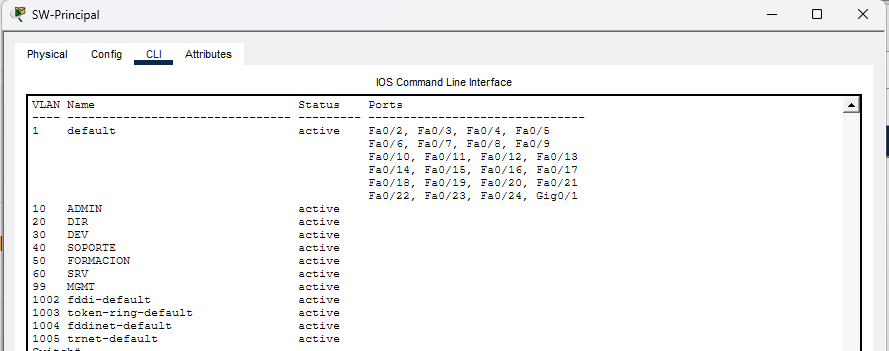
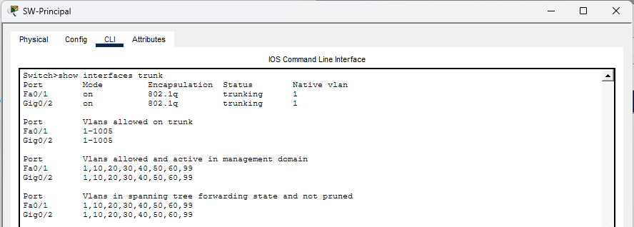
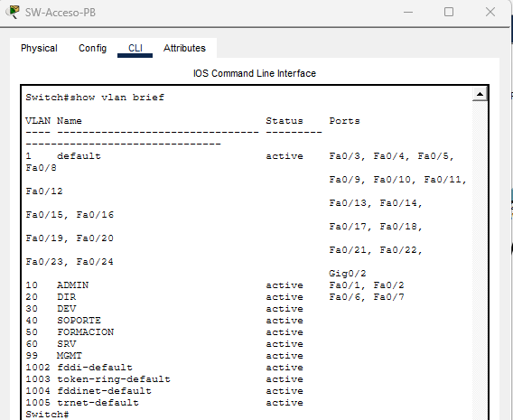
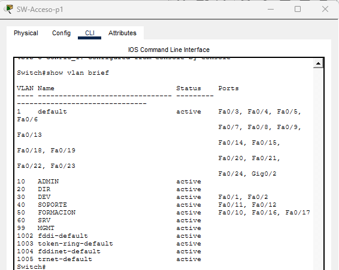
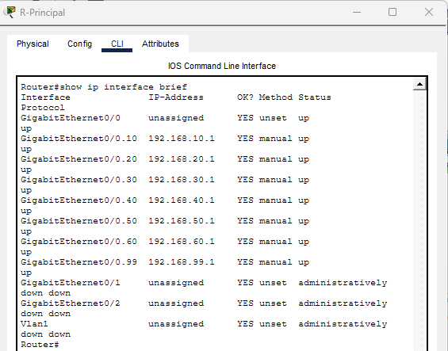
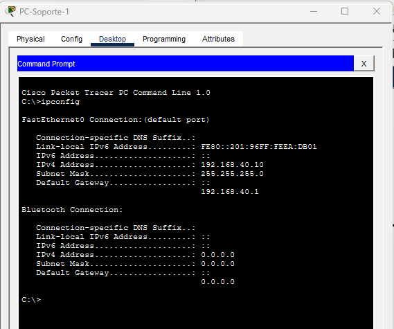
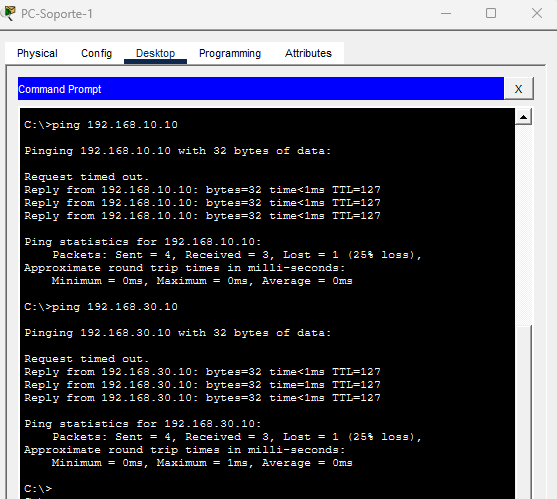
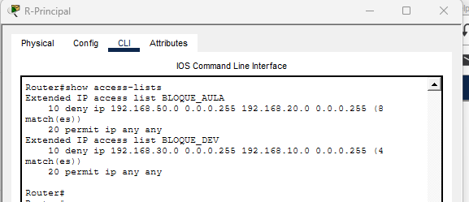
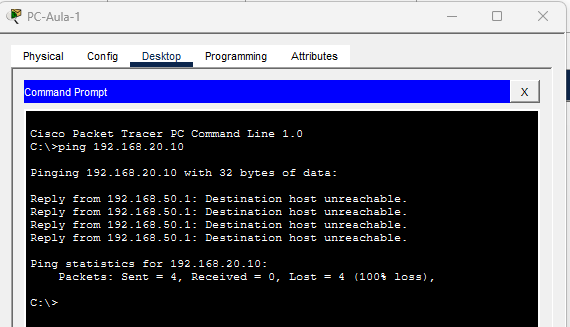
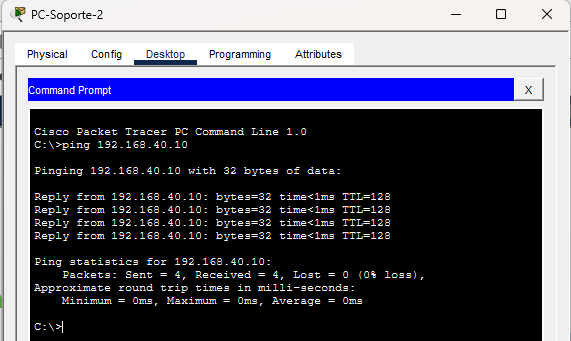

## 4. Configuración de la red

### 4.1 Creación de VLANs

Se han creado las VLANs necesarias en todos los switches de la red con el objetivo de segmentar los distintos departamentos de la empresa.

Las VLANs configuradas son:

| VLAN | Nombre     | Departamento     |
|------|------------|------------------|
| 10   | ADMIN      | Administración   |
| 20   | DIR        | Dirección        |
| 30   | DEV        | Desarrollo       |
| 40   | SOPORTE    | Soporte técnico  |
| 50   | FORMACION  | Aula formación   |
| 60   | SRV        | Servidores       |
| 99   | MGMT       | Gestión          |

Para su creación se ha accedido al modo de configuración de cada switch mediante CLI, creando cada VLAN y asignándole un nombre descriptivo.

La verificación se ha realizado utilizando el comando:

#### Evidencia de configuración

---

### 4.2 Configuración de enlaces troncales (Trunk)

Se han configurado enlaces troncales entre el switch principal y los switches de acceso, así como entre el router y el switch principal.

Estos enlaces permiten el transporte de múltiples VLANs a través de un único enlace físico mediante el protocolo IEEE 802.1Q.

Los puertos configurados en modo trunk son:

- Switch Principal → Switch Acceso PB  
- Switch Principal → Switch Acceso P1  
- Router → Switch Principal  

La verificación se ha realizado mediante el comando:

#### Evidencia de configuración

---

### 4.3 Verificación de la configuración

Se ha comprobado el correcto funcionamiento de la configuración mediante los siguientes puntos:

- Existencia de todas las VLANs en los switches  
- Propagación correcta de VLANs a través de los enlaces troncales  
- Estado activo de los puertos trunk  
- Correspondencia entre VLANs creadas y diseño de red  

Los resultados obtenidos confirman que la segmentación de red se ha implementado correctamente.

---

### 4.4 Asignación de puertos a VLANs

Se ha procedido a la asignación de los puertos de los switches a sus correspondientes VLANs según el departamento al que pertenecen.

Para ello se ha configurado cada puerto en modo access y se le ha asignado la VLAN correspondiente.

Esto permite que cada equipo de la red quede correctamente segmentado y aislado del resto de departamentos.

---

### 4.5 Detalle de asignación de puertos

La asignación realizada es la siguiente:

- VLAN 10 (ADMIN): Fa0/1-2 en SW-Acceso-PB  
- VLAN 20 (DIR): Fa0/6-7 en SW-Acceso-PB  

- VLAN 30 (DEV): Fa0/1-2 en SW-Acceso-P1  
- VLAN 40 (SOPORTE): Fa0/11-12 en SW-Acceso-P1  
- VLAN 50 (FORMACION): Fa0/16-17 en SW-Acceso-P1  

- Punto de acceso: Fa0/3 en SW-Acceso-P1 (configurado en VLAN 10)  

- VLAN 60 (SRV): Fa0/21-23 en SW-Principal  

---

### 4.6 Evidencias de configuración

---

### 4.7 Verificación

Se ha comprobado que los puertos de los switches se encuentran correctamente asignados a sus respectivas VLANs mediante el comando:

---

### 4.8 Configuración de enrutamiento inter-VLAN

Para permitir la comunicación entre las diferentes VLANs, se ha implementado enrutamiento inter-VLAN mediante la técnica Router-on-a-stick.

Esta decisión se ha tomado debido a que el switch principal (Cisco 2960) no dispone de capacidades de capa 3.

---

### 4.9 Direccionamiento del router

Se han configurado las siguientes direcciones IP en el router:

- VLAN 10 → 192.168.10.1  
- VLAN 20 → 192.168.20.1  
- VLAN 30 → 192.168.30.1  
- VLAN 40 → 192.168.40.1  
- VLAN 50 → 192.168.50.1  
- VLAN 60 → 192.168.60.1  
- VLAN 99 → 192.168.99.1  

---

### 4.10 Evidencia de configuración

---

### 4.11 Verificación

Se ha comprobado que todas las subinterfaces del router se encuentran en estado "up/up".

---

### 4.12 Configuración de DHCP

El servicio DHCP se ha configurado en un servidor dedicado ubicado en la VLAN 60.

---

### 4.13 Verificación del direccionamiento

---

### 4.14 Prueba de conectividad

---

### 4.15 Configuración de ACLs

Se han implementado listas de control de acceso (ACLs) en el router con el objetivo de restringir la comunicación entre determinadas VLANs.

---

### 4.16 Reglas de filtrado implementadas

- VLAN 50 no puede acceder a VLAN 20  
- VLAN 30 no puede acceder a VLAN 10  

---

### 4.17 Verificación de las ACLs

---

## 4.18 Configuración de la red inalámbrica

Se ha implementado un punto de acceso WiFi para proporcionar conexión inalámbrica a los empleados.

El punto de acceso está conectado al switch de la primera planta en el puerto Fa0/3, configurado en modo access en la VLAN 10.

---

### 4.19 Configuración del punto de acceso

- SSID: SSID_EMPRESA  
- Seguridad: WPA2-PSK  
- Contraseña: Empresa123  

---

### 4.20 Asignación de direcciones IP (WiFi)

Los dispositivos inalámbricos obtienen dirección IP automáticamente mediante DHCP dentro de la red 192.168.10.0/24.

---

### 4.21 Prueba de funcionamiento

Se ha verificado la conexión mediante pruebas de red.

---

### 4.22 Limitaciones

Debido a las limitaciones del dispositivo AccessPoint-PT en Cisco Packet Tracer, no es posible configurar múltiples redes WiFi.

En un entorno real, se utilizarían puntos de acceso avanzados con múltiples SSID y segmentación por VLAN.

