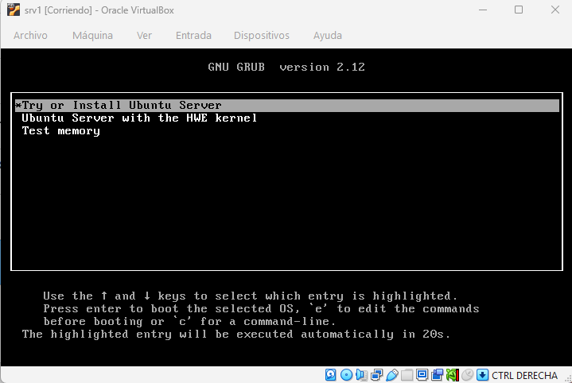
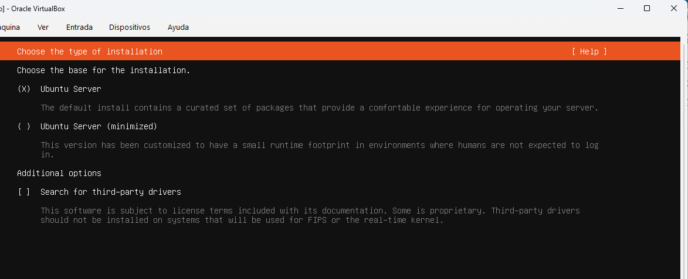
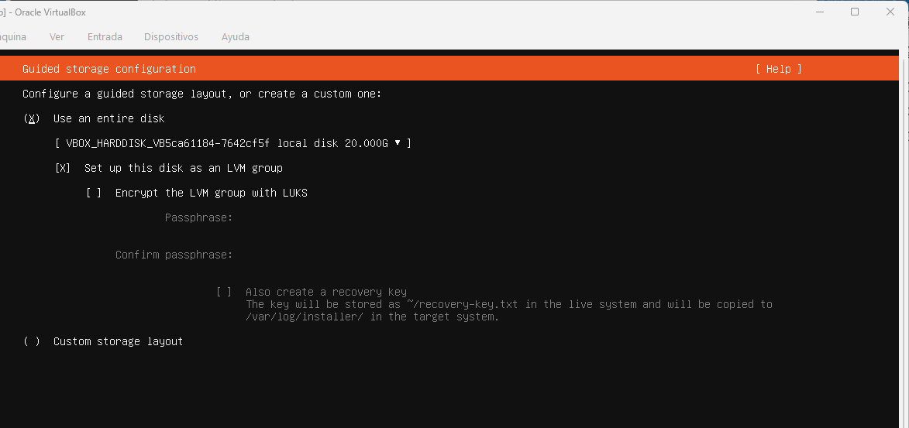
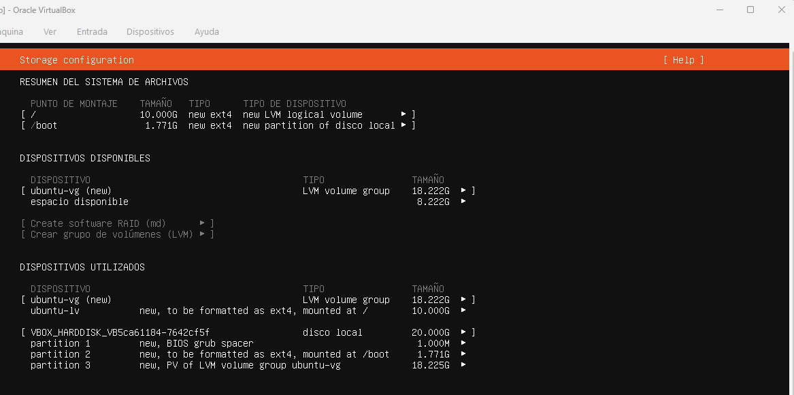
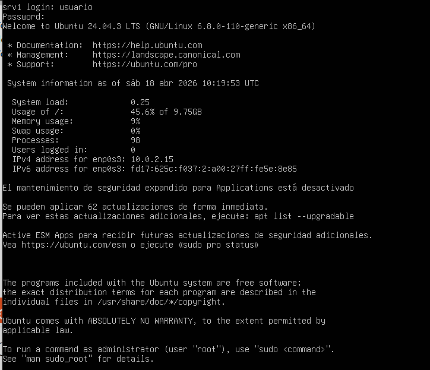

## Instalación del servidor srv1

Se ha desplegado una máquina virtual denominada **srv1** utilizando Ubuntu Server 24.04 LTS en VirtualBox.

### Parámetros de instalación

Durante el proceso de instalación se han configurado los siguientes valores:

- Nombre del sistema: srv1  
- Usuario principal: usuario  
- Instalación de OpenSSH: habilitada  
- Tipo de almacenamiento: uso completo del disco con LVM  

La instalación se ha realizado utilizando las opciones recomendadas por el instalador, sin incidencias.

---

### Proceso de instalación

#### Inicio de la instalación

#### Selección del tipo de instalación

#### Configuración del disco

#### Resumen de particionado

---

### Acceso al sistema

Una vez finalizada la instalación y reiniciado el sistema, se ha comprobado el acceso mediante login en consola con el usuario creado.

---

### Verificación inicial

Se ha verificado que el sistema arranca correctamente y permite el acceso sin errores.

El servidor queda listo para la configuración de red y la instalación de servicios.

---

### Estado final del sistema

Tras completar la instalación:

- Sistema operativo instalado correctamente  
- Usuario configurado y operativo  
- Acceso por consola funcional  
- Servicio SSH disponible  

El servidor se encuentra preparado para continuar con la configuración del sistema.
