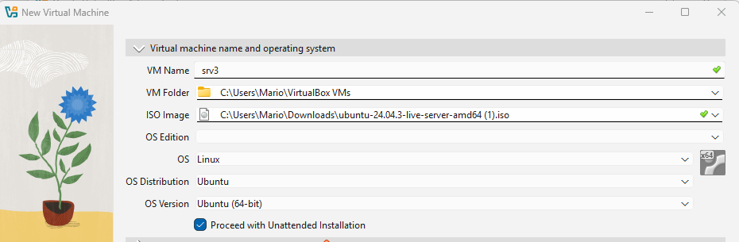
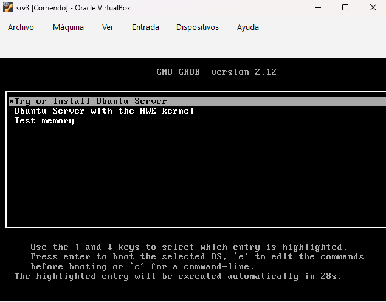
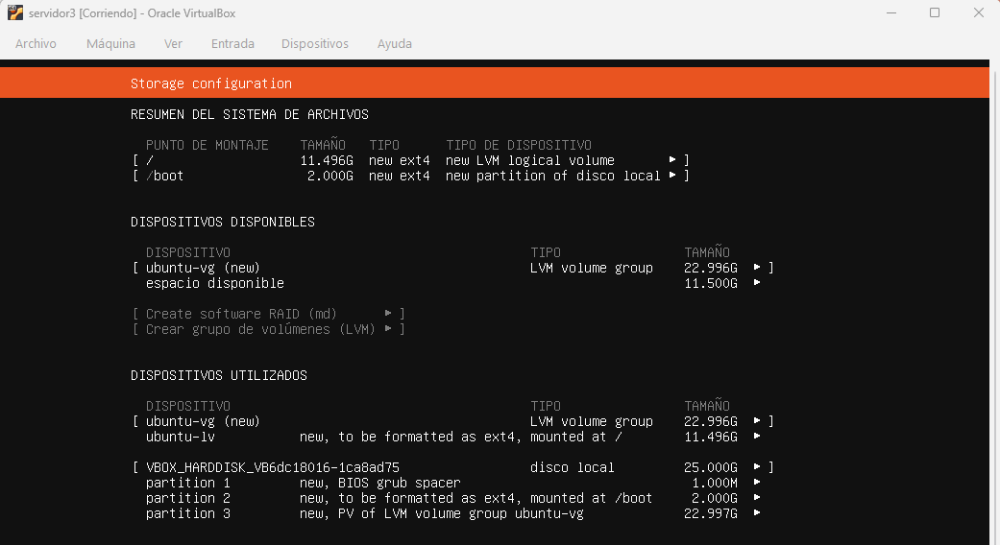
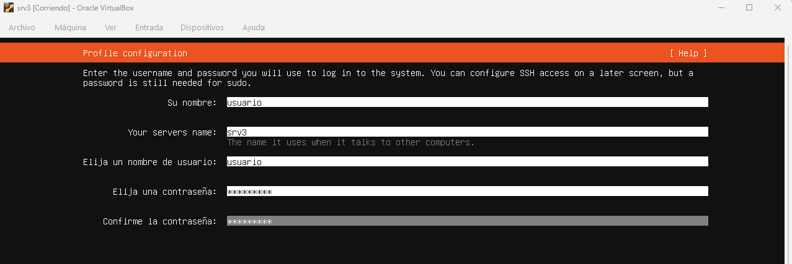
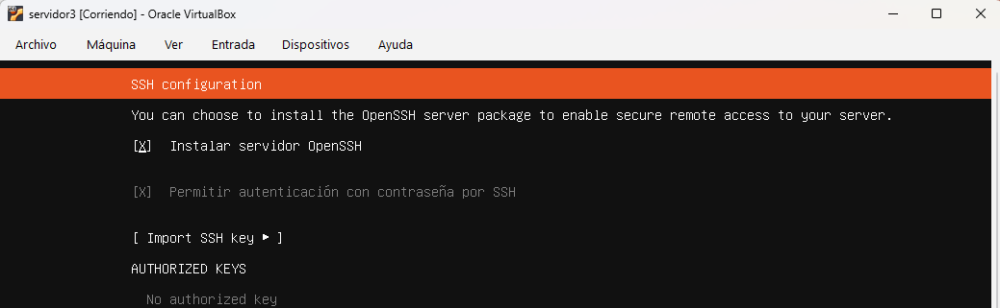
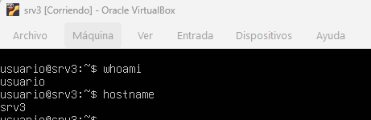

# srv3 – Instalación del servidor

## 1. Introducción

Se ha desplegado una máquina virtual denominada **srv3** utilizando Ubuntu Server 24.04 LTS en VirtualBox.  
Este servidor tiene como función principal actuar como **servidor DHCP** dentro de la infraestructura de red del proyecto.

---

## 2. Parámetros de instalación

Durante el proceso de instalación se han configurado los siguientes valores:

- **Nombre del sistema:** srv3  
- **Usuario principal:** usuario  
- **Instalación de OpenSSH:** habilitada  
- **Tipo de almacenamiento:** uso completo del disco  
- **Virtualización:** VirtualBox  

La instalación se ha realizado siguiendo el mismo procedimiento que en srv1 y srv2 para mantener coherencia en la infraestructura.

---

## 3. Proceso de instalación

### 3.1 Creación de la máquina virtual

  

---

### 3.2 Selección del tipo de instalación

  

---

### 3.3 Configuración del disco

  

---

### 3.4 Configuración de usuario

  

---

### 3.5 Configuración de SSH

  

---

## 4. Acceso al sistema

Una vez finalizada la instalación, se accede al sistema mediante login en consola.

  

---

## 5. Verificación inicial del sistema

Se ha comprobado el correcto funcionamiento del sistema mediante los siguientes comandos:

`whoami`  
Resultado: usuario  

`hostname`  
Resultado: srv3  

---

## 6. Estado final

Tras completar la instalación:

- Sistema operativo instalado correctamente  
- Usuario configurado y operativo  
- Acceso por consola funcional  
- Servicio SSH disponible 
El servidor queda preparado para la configuración de red y la instalación de servicios.
