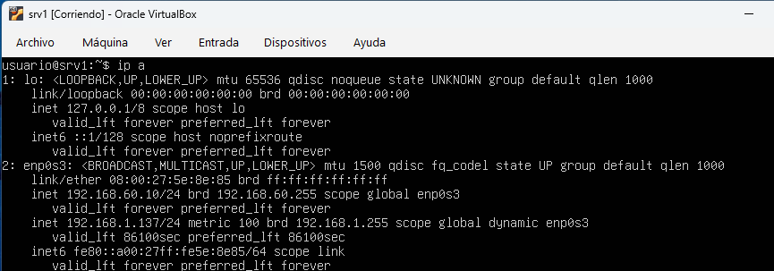
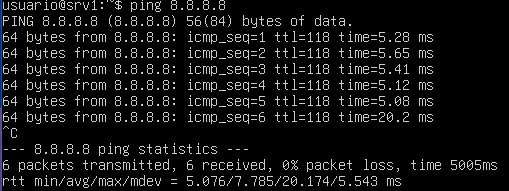

# srv1-red – Configuración de red del servidor

## 1. Introducción

En este documento se describe la configuración de red del servidor **srv1**, realizada tras la instalación del sistema operativo.  
El objetivo es garantizar que el servidor esté correctamente integrado dentro de la red local y disponga de conectividad.

---

## 2. Interfaz de red

El servidor utiliza la siguiente interfaz de red:

- **Nombre:** enp0s3  
- **Tipo:** Adaptador de red en VirtualBox  
- **Modo:** Adaptador puente  

Para comprobar la interfaz se ha utilizado el comando:

```bash
ip a
```

Se observa que la interfaz **enp0s3** está activa.

---

## 3. Configuración de red

La configuración de red se realiza mediante DHCP, permitiendo al servidor obtener automáticamente una dirección IP dentro de la red local.

La interfaz enp0s3 está asociada a un adaptador en modo puente, lo que permite al servidor integrarse directamente en la red local.

---

## 4. Verificación de la configuración

### 4.1 Comprobación de IP

```bash
ip a
```

Resultado relevante:

```text
2: enp0s3: <BROADCAST,MULTICAST,UP,LOWER_UP> ...
    inet 192.168.1.137/24 metric 100 brd 192.168.1.255 ...
```

<p align="center">
  
</p>

---

### 4.2 Conectividad externa

```bash
ping -c 4 8.8.8.8
```

Resultado:

```text
4 packets transmitted, 4 received, 0% packet loss
```

<p align="center">
  
</p>

---

## 5. Estado final de la red

Tras las comprobaciones realizadas:

- Interfaz de red operativa (**enp0s3**)  
- Dirección IP obtenida correctamente mediante DHCP  
- Conectividad a red local verificada  
- Conectividad a Internet verificada  

El servidor queda correctamente configurado y preparado para la instalación de servicios.

