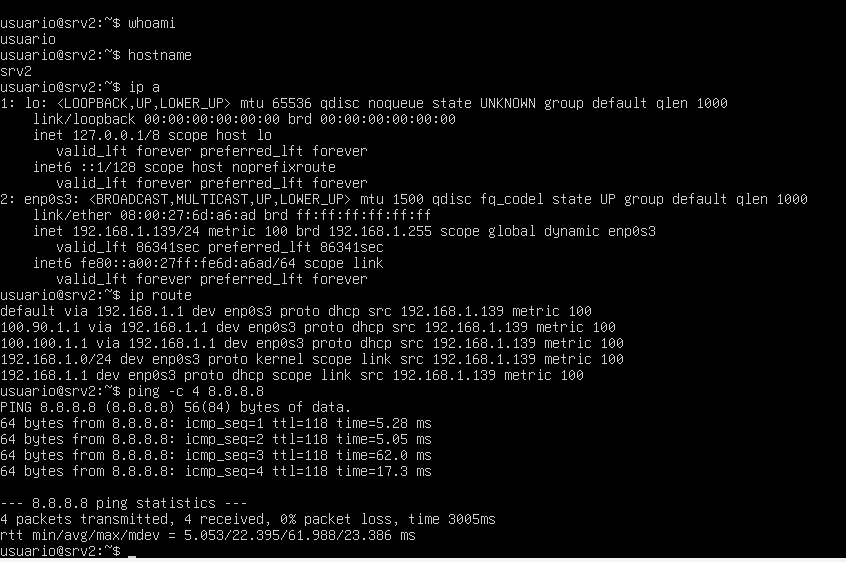

# srv2-red – Configuración de red del servidor

## 1. Introducción

En este documento se describe la configuración de red del servidor **srv2**, necesaria para su integración dentro de la red local.

---

## 2. Interfaz de red

El servidor utiliza la siguiente interfaz de red:

- **Nombre:** enp0s3  
- **Tipo:** Adaptador de red en VirtualBox  
- **Modo:** Adaptador puente  

---

## 3. Configuración de red

La configuración de red se realiza mediante DHCP, permitiendo al servidor obtener automáticamente una dirección IP dentro de la red local.

Durante la configuración, el servidor ha obtenido los siguientes parámetros:

- **Dirección IP:** 192.168.1.139  
- **Máscara de red:** 255.255.255.0  
- **Puerta de enlace:** 192.168.1.1  

---

## 4. Verificación de la configuración

Se ha comprobado el correcto funcionamiento de la red mediante los siguientes comandos:

`ip a`  
Resultado: dirección IP asignada correctamente  

`ip route`  
Resultado: puerta de enlace configurada correctamente  

`ping -c 4 8.8.8.8`  
Resultado: 0% packet loss  

  

---

## 5. Estado final de la red

Tras las comprobaciones realizadas:

- Interfaz de red operativa (**enp0s3**)  
- Dirección IP obtenida correctamente mediante DHCP  
- Conectividad a red local verificada  
- Conectividad a Internet verificada  

El servidor queda correctamente integrado dentro de la red.
