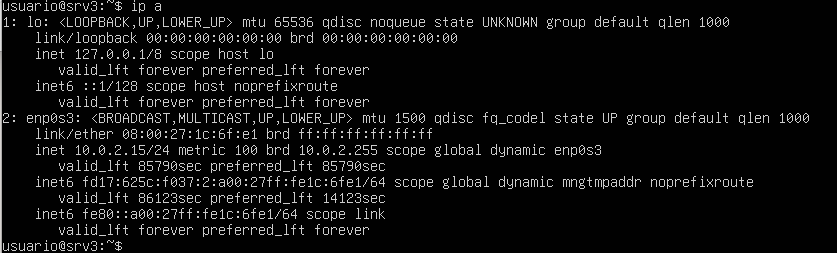
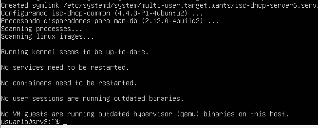
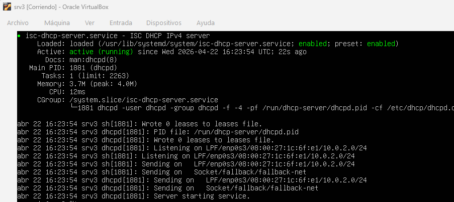
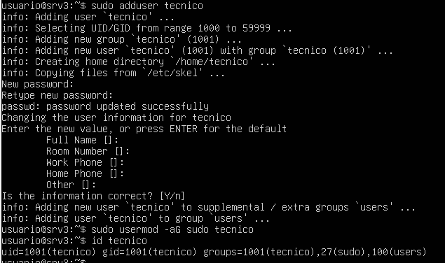
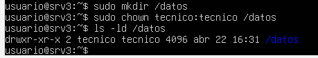

# srv3 – Configuración del sistema

## 1. Introducción

En este documento se describe la configuración del servidor **srv3**, una vez finalizada la instalación del sistema operativo.

Este servidor tiene como función principal actuar como **servidor DHCP** dentro de la infraestructura del proyecto.

---

## 2. Configuración de red

Se ha verificado la configuración de red mediante el comando `ip a`.

  

El servidor obtiene dirección IP automáticamente mediante DHCP.

- **Dirección IP:** 10.0.2.15  
- **Interfaz:** enp0s3  

---

## 3. Instalación del servicio DHCP

Se ha instalado el servidor DHCP mediante el siguiente comando:

`sudo apt install isc-dhcp-server -y`

  

---

## 4. Configuración del servicio DHCP

### 4.1 Configuración de la interfaz

Se ha configurado la interfaz de red en la que escuchará el servicio DHCP.

Archivo modificado: `/etc/default/isc-dhcp-server`

Configuración aplicada:

`INTERFACESv4="enp0s3"`

---

### 4.2 Configuración del rango DHCP

Se ha configurado el archivo `/etc/dhcp/dhcpd.conf` con el siguiente contenido:

`subnet 10.0.2.0 netmask 255.255.255.0 {  
  range 10.0.2.50 10.0.2.100;  
  option routers 10.0.2.2;  
  option domain-name-servers 8.8.8.8;  
}`

Esta configuración permite asignar direcciones IP automáticamente a los equipos de la red.

---

## 5. Activación del servicio

Se ha iniciado el servicio DHCP mediante:

`sudo systemctl restart isc-dhcp-server`

Se ha comprobado su estado con:

`systemctl status isc-dhcp-server`

  

El servicio se encuentra en estado **active (running)**.

---

## 6. Verificación del servicio

Para comprobar el funcionamiento del servicio DHCP se pueden revisar los logs del sistema:

`sudo journalctl -u isc-dhcp-server`

Esto permite verificar la actividad del servicio y posibles asignaciones de direcciones IP.

---

## 7. Consideraciones sobre el entorno de red

Debido a las limitaciones del entorno de virtualización utilizado (VirtualBox), el servidor **srv3** se encuentra en una red interna (10.0.2.0/24) distinta al esquema de direccionamiento definido en el diseño de red del proyecto.

Esta red corresponde al modo NAT de VirtualBox, utilizado para facilitar la conectividad y pruebas durante la fase de implantación.

Por este motivo, el servicio DHCP se configura sobre la red 10.0.2.0/24, permitiendo comprobar su funcionamiento en un entorno aislado.

En un entorno real, el servidor DHCP estaría configurado dentro de la VLAN correspondiente (por ejemplo 192.168.10.0/24 o VLAN de servicios), gestionando el direccionamiento IP de todos los dispositivos de la red según el plan definido.

---

## 8. Gestión de usuarios

Se ha creado un usuario adicional para tareas administrativas:

`sudo adduser tecnico`  
`sudo usermod -aG sudo tecnico`

  

---

## 9. Gestión de permisos

Se ha creado un directorio para almacenamiento de datos:

`sudo mkdir /datos`  
`sudo chown tecnico:tecnico /datos`

  

---

## 10. Comprobaciones finales

Se han realizado las siguientes comprobaciones para verificar el correcto funcionamiento del servidor:

`sudo systemctl is-active isc-dhcp-server`  
Resultado: active  

`sudo ss -tulpn | grep dhcp`  
Resultado: servicio escuchando correctamente en la red  

`sudo journalctl -u isc-dhcp-server`  
Resultado: sin errores críticos  

Estas comprobaciones permiten verificar que el servicio DHCP está activo y funcionando correctamente.

---

## 11. Estado final

Tras completar la configuración:

- Red correctamente configurada  
- Servicio DHCP instalado y en funcionamiento  
- Usuario administrativo creado  
- Permisos configurados correctamente  

El servidor **srv3** queda preparado para su funcionamiento dentro de la infraestructura del proyecto.
