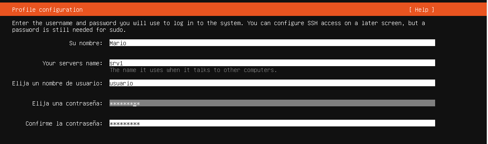
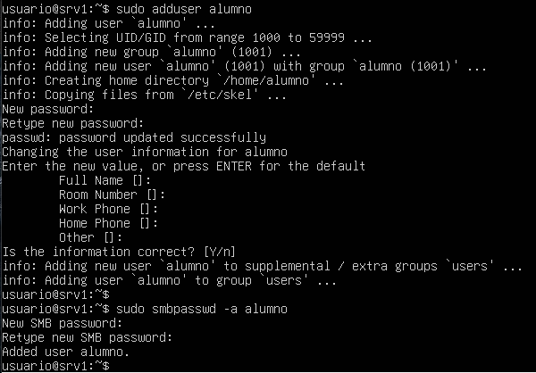

# srv1 – Gestión de usuarios

## 1. Introducción

En este apartado se describe la creación y configuración de usuarios en el servidor **srv1**, necesaria para gestionar el acceso a los recursos del sistema y a los servicios implementados.

---

## 2. Usuario del sistema

Durante la instalación del sistema se creó el usuario principal:

- **Usuario:** usuario  
- **Tipo:** usuario estándar con privilegios de administración (sudo)

Para comprobar el usuario activo se ha utilizado el comando:

`whoami`

Resultado:  
usuario  

---

## 3. Creación de usuario para servicios

Se ha creado un usuario específico para el acceso a recursos compartidos mediante Samba:

`sudo adduser alumno`

Durante el proceso se ha asignado una contraseña y se han completado los datos básicos del usuario.

  

---

## 4. Configuración de usuario en Samba

Para permitir el acceso al recurso compartido, se ha añadido el usuario al sistema de autenticación de Samba:

`sudo smbpasswd -a alumno`

Se ha establecido la contraseña correspondiente para el acceso al recurso compartido.

  

---

## 5. Verificación del usuario

Se ha comprobado que el usuario ha sido creado correctamente y está disponible en el sistema:

`id alumno`

Resultado:  
uid=1001(alumno) gid=1001(alumno) groups=1001(alumno)  

El usuario pertenece a su grupo propio creado automáticamente durante el proceso.

---

## 6. Estado final

Tras la configuración realizada:

- Usuario del sistema operativo correctamente creado  
- Usuario adicional (**alumno**) creado para servicios  
- Usuario añadido al sistema de autenticación de Samba  
- Credenciales configuradas correctamente  

El sistema queda preparado para el acceso autenticado a los recursos compartidos.
