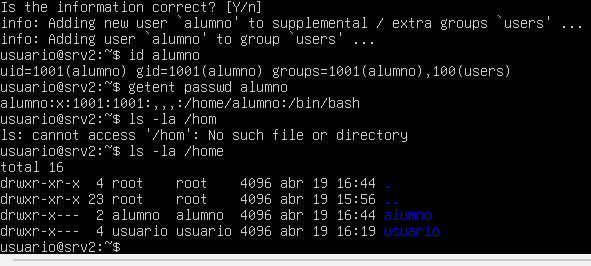

# srv2 – Gestión de usuarios

## 1. Introducción

En este apartado se describe la creación y configuración de usuarios en el servidor **srv2**, necesaria para gestionar el acceso al sistema.

---

## 2. Usuario del sistema

Durante la instalación del sistema se creó el usuario principal:

- **Usuario:** usuario  
- **Tipo:** usuario estándar con privilegios de administración (sudo)

Para comprobar el usuario activo se ha utilizado el comando:

`whoami`

Resultado:  
usuario  

---

## 3. Creación de usuario

Se ha creado un usuario adicional en el sistema:

`sudo adduser alumno`

Durante el proceso se ha asignado una contraseña y se han completado los datos básicos del usuario.

---

## 4. Verificación del usuario

Se ha comprobado que el usuario ha sido creado correctamente mediante los siguientes comandos:

`id alumno`  
Resultado:  
uid=1001(alumno) gid=1001(alumno) groups=1001(alumno),100(users)  

`getent passwd alumno`  
Resultado:  
alumno:x:1001:1001::/home/alumno:/bin/bash  

`ls -la /home`  
Resultado:  
Se observa la creación del directorio `/home/alumno` correspondiente al usuario.

  

---

## 5. Estado final

Tras la configuración realizada:

- Usuario del sistema operativo correctamente creado  
- Usuario adicional (**alumno**) creado  
- Directorio personal generado correctamente  
- Usuario registrado en el sistema  

El sistema queda preparado para la gestión de usuarios.
