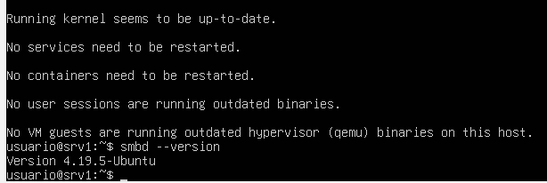
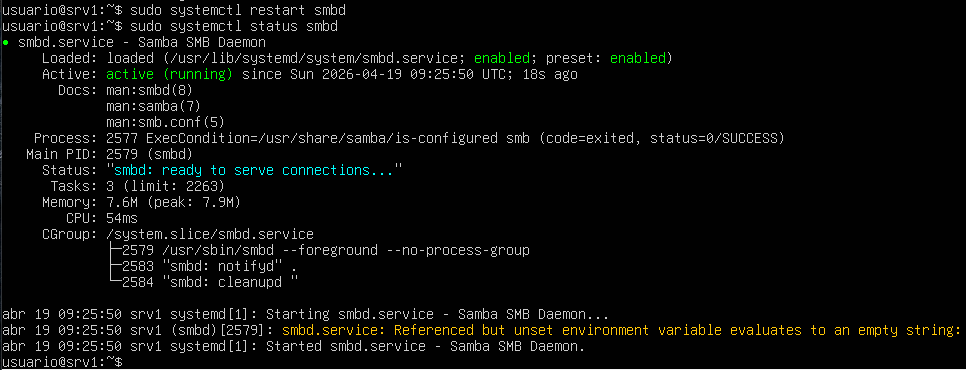
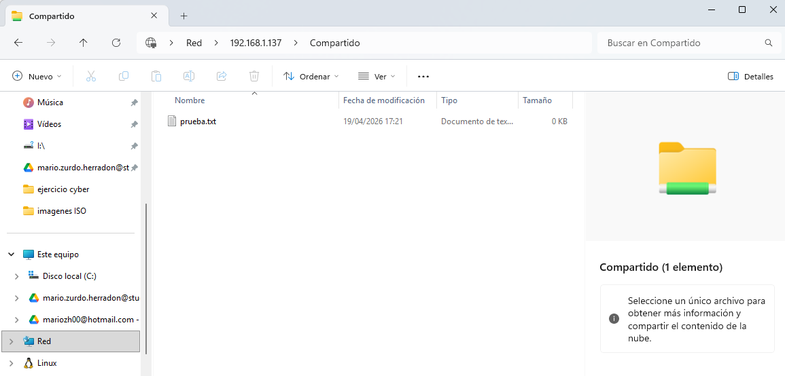

# srv1 – Servicio Samba

## 1. Introducción

En este apartado se describe la instalación y configuración del servicio **Samba** en el servidor **srv1**, utilizado para compartir archivos en red con equipos cliente.

---

## 2. Instalación de Samba

Para instalar el servicio Samba se han utilizado los siguientes comandos:

`sudo apt update`  
`sudo apt install samba`

Se ha comprobado la instalación del servicio:

`smbd --version`

Resultado:  
Samba instalado correctamente

  

---

## 3. Estado del servicio

Se ha verificado que el servicio Samba se encuentra activo:

`systemctl status smbd`

Resultado:  
Servicio activo en ejecución (**active (running)**)

  

---

## 4. Creación del directorio compartido

Se ha creado un directorio destinado a ser compartido en red:

`sudo mkdir /srv/samba/compartido`

Se han asignado los permisos necesarios:

`sudo chown alumno:alumno /srv/samba/compartido`  
`sudo chmod 770 /srv/samba/compartido`

---

## 5. Configuración del recurso compartido

Se ha editado el archivo de configuración de Samba:

`sudo nano /etc/samba/smb.conf`

Se ha añadido el siguiente recurso compartido al final del archivo:

[Compartido]  
path = /srv/samba/compartido  
valid users = alumno  
read only = no  
browsable = yes  
create mask = 0770  
directory mask = 0770  

Se ha comprobado la sintaxis de la configuración:

`testparm`

Resultado:  
Configuración válida sin errores

---

## 6. Reinicio del servicio

Para aplicar los cambios realizados se ha reiniciado el servicio Samba:

`sudo systemctl restart smbd`

---

## 7. Verificación del servicio

Se ha comprobado que el servicio está funcionando correctamente:

`systemctl status smbd`

Resultado:  
Servicio activo en ejecución (**active (running)**)

También se ha verificado el acceso desde un cliente Windows utilizando las credenciales del usuario configurado (**alumno**).

Se accede al recurso mediante:

`\\192.168.1.137`

Se ha creado un archivo de prueba (**prueba.txt**) dentro del recurso compartido, confirmando los permisos de escritura.

  

---

## 8. Estado final

Tras la configuración realizada:

- Servicio Samba instalado y operativo  
- Recurso compartido configurado correctamente  
- Usuario con permisos de acceso configurado  
- Permisos de lectura y escritura verificados  
- Acceso desde cliente validado  

El servidor queda preparado para compartir archivos dentro de la red.
