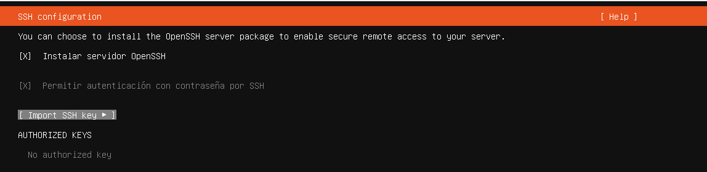
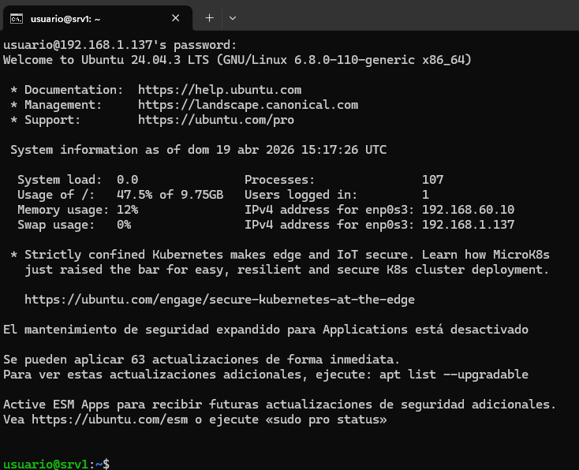

# srv1-ssh – Acceso remoto mediante SSH

## 1. Introducción

En este apartado se verifica el funcionamiento del servicio **SSH** en el servidor **srv1**, el cual permite el acceso remoto seguro desde otros equipos de la red.

SSH (Secure Shell) facilita la administración del sistema de forma remota mediante una conexión cifrada.

---

## 2. Instalación del servicio

El servicio SSH se encuentra instalado desde el proceso de instalación del sistema operativo, al haber seleccionado la opción de instalar el servidor OpenSSH.

---

## 3. Estado del servicio

Se comprueba que el servicio SSH se encuentra activo en el sistema:

`systemctl status ssh`

Resultado:  
Servicio activo en ejecución (**active (running)**)

  

---

## 4. Verificación de conectividad

Se realiza una conexión remota desde otro equipo de la red hacia el servidor.

Comando utilizado:

`ssh usuario@192.168.1.137`

Resultado:  
Se establece conexión correctamente solicitando las credenciales del usuario y mostrando el acceso al sistema.

  

---

## 5. Verificación adicional

Se comprueba que el servicio SSH está habilitado en el arranque del sistema:

`systemctl is-enabled ssh`

Resultado:  
enabled

---

## 6. Funcionamiento del servicio

Una vez autenticado, se obtiene acceso a la terminal del servidor, lo que permite:

- Ejecución de comandos remotos  
- Administración del sistema  
- Gestión de servicios  

---

## 7. Estado final

El servicio SSH se encuentra correctamente operativo:

- Servicio activo  
- Servicio habilitado en el arranque  
- Acceso remoto funcional  
- Autenticación de usuarios operativa  

El servidor queda preparado para su administración remota dentro de la red.
