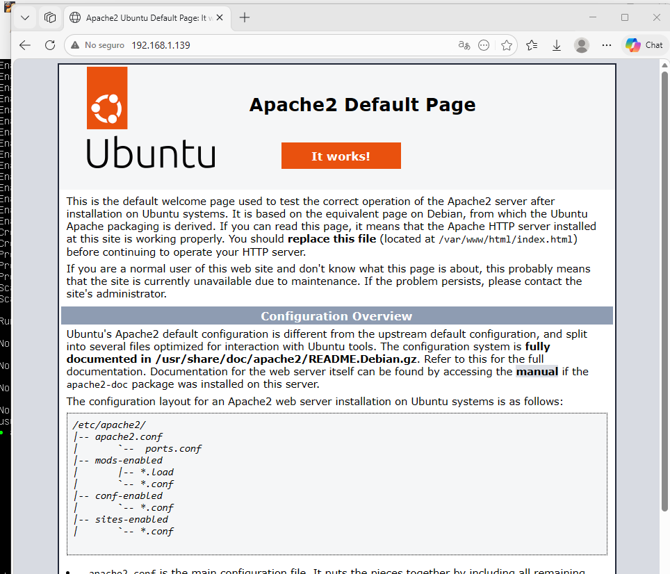
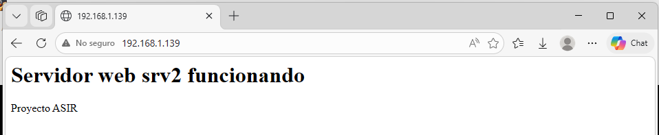

# srv2-apache – Servicio web Apache

## 1. Introducción

En este apartado se describe la instalación y configuración del servicio **Apache** en el servidor **srv2**, utilizado para ofrecer contenido web en la red.

---

## 2. Instalación del servicio

Para instalar el servicio Apache se han utilizado los siguientes comandos:

`sudo apt update`  
`sudo apt install apache2 -y`

---

## 3. Estado del servicio

Para comprobar el estado del servicio se ha utilizado el siguiente comando:

`systemctl status apache2`

Resultado:  
Servicio activo en ejecución (**active (running)**)

---

## 4. Verificación del servicio

Se ha comprobado el acceso al servidor web desde un equipo cliente mediante navegador:

`http://192.168.1.139`

Página por defecto de Apache:

  

---

## 5. Personalización del sitio web

Se ha modificado el archivo principal del servidor web para mostrar contenido personalizado:

`echo "<h1>Servidor web srv2 funcionando</h1>
Proyecto ASIR
" | sudo tee /var/www/html/index.html`

Posteriormente, se ha reiniciado el servicio para aplicar los cambios:

`sudo systemctl restart apache2`

---

## 6. Resultado

Tras la modificación, se ha comprobado que el servidor muestra el contenido personalizado:

  

---

## 7. Estado final

Tras la configuración realizada:

- Servicio Apache instalado y operativo  
- Acceso web funcional desde la red  
- Página web personalizada configurada correctamente  

El servidor queda preparado para ofrecer servicios web dentro de la infraestructura del proyecto.
