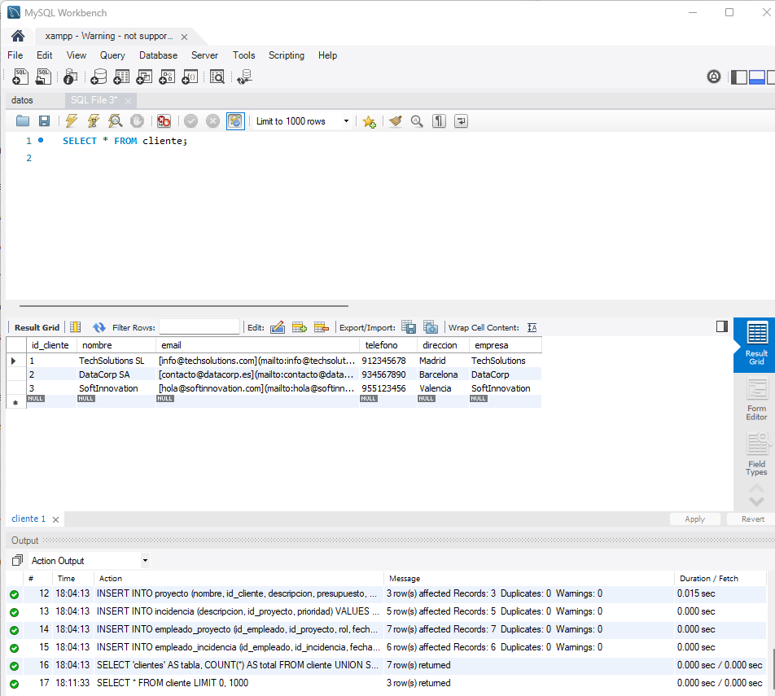
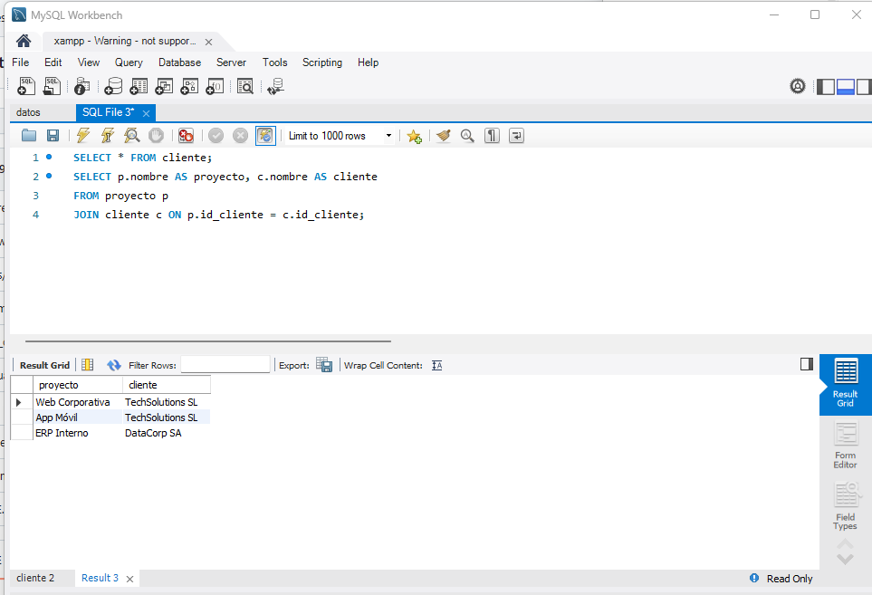
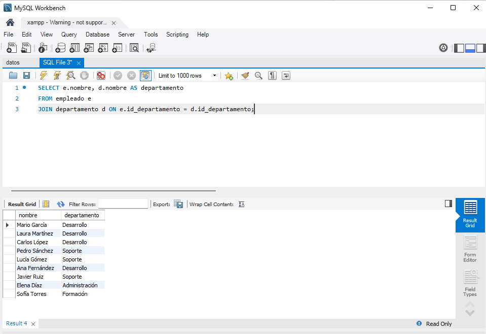
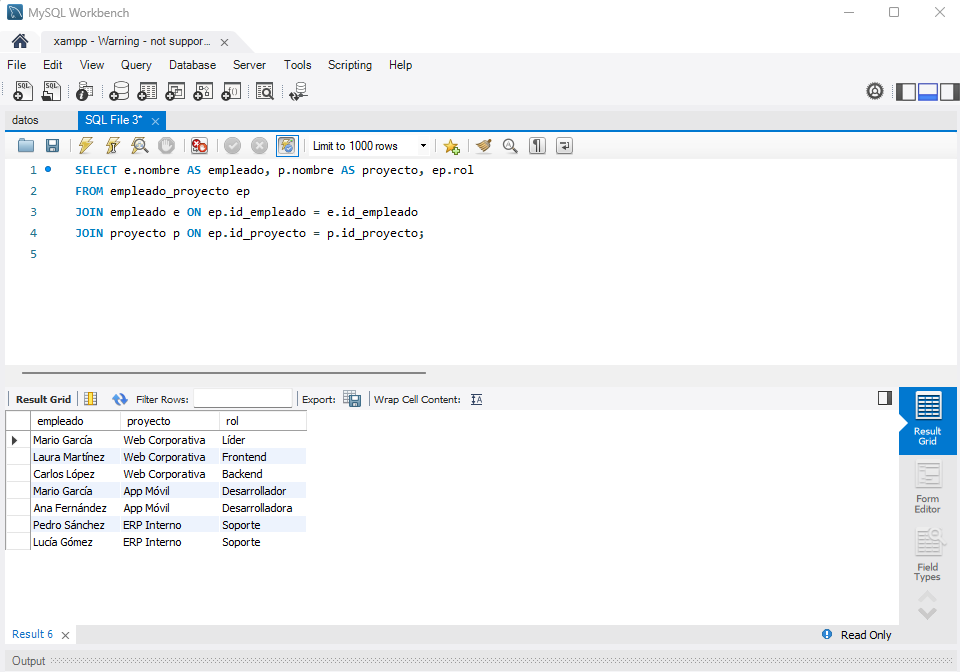
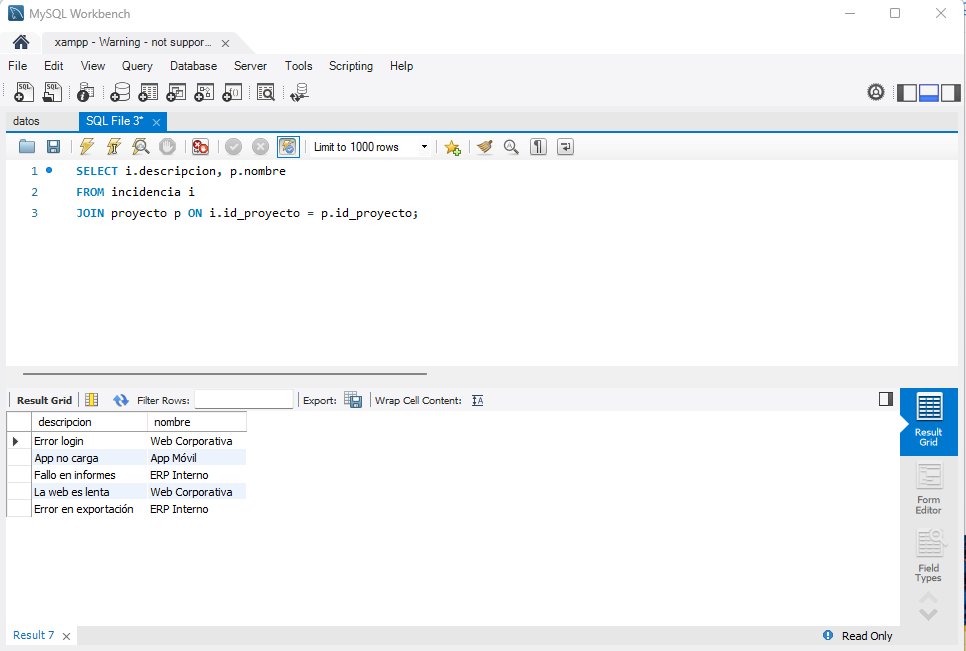
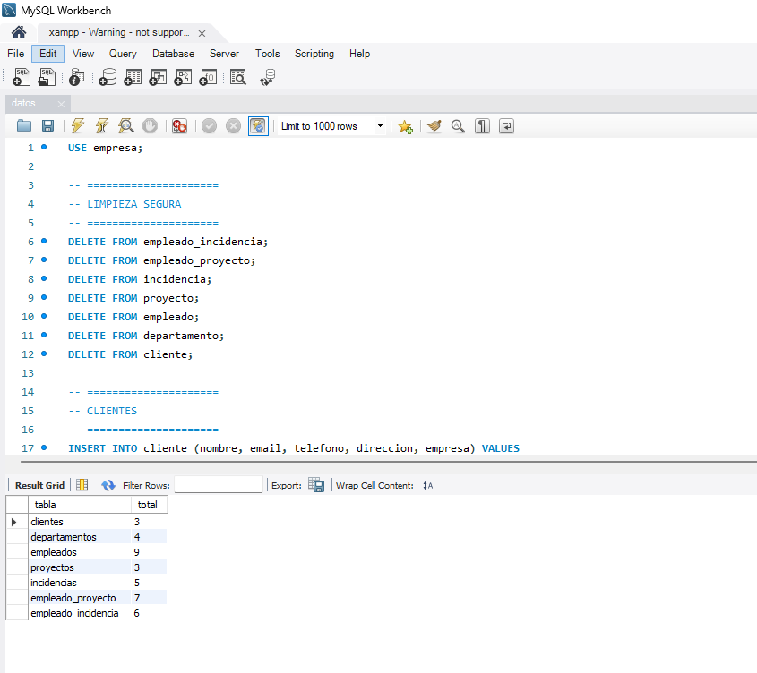

# Base de Datos - Proyecto ASIR

## Descripción

Se ha diseñado e implementado una base de datos relacional para una empresa de desarrollo de software.
El sistema permite gestionar clientes, proyectos, empleados, departamentos e incidencias.

---

## Modelo de datos

El modelo está compuesto por las siguientes entidades:

* Cliente
* Proyecto
* Empleado
* Departamento
* Incidencia
* Empleado_Proyecto (relación N:M)
* Empleado_Incidencia (relación N:M)

Se han definido claves primarias (PK) y claves foráneas (FK) para garantizar la integridad referencial.

---

## Tecnologías utilizadas

* MySQL / MariaDB (XAMPP)
* MySQL Workbench
* SQL

---

## Estructura del proyecto

```
05_base_datos/
├── scripts_sql/
│   ├── 01_creacion.sql
│   ├── 02_datos.sql
│   ├── 03_consultas.sql
├── documentacion/
│   ├── 01_analisis.md
│   ├── 02_diseño.md
│   ├── diagrama_er.png
│   └── capturas/
```

---

## Capturas de funcionamiento

### Datos de clientes



---

### Proyectos y clientes



---

### Empleados y departamentos



---

### Relación N:M (Empleado - Proyecto)



---

### Incidencias



---

### Verificación de datos



---

## Conclusión

La base de datos permite gestionar correctamente la información de la empresa, garantizando la integridad de los datos y permitiendo consultas eficientes mediante SQL.


