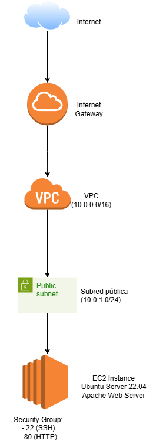
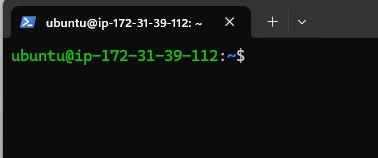
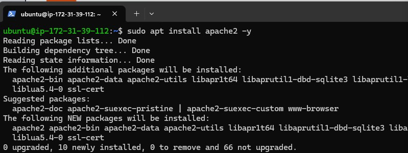
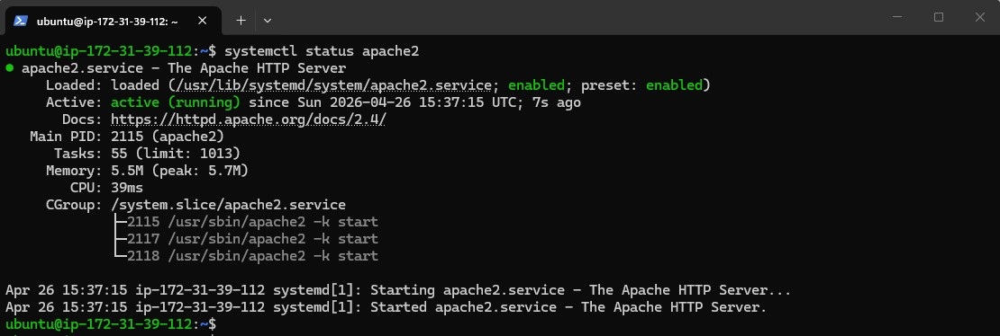
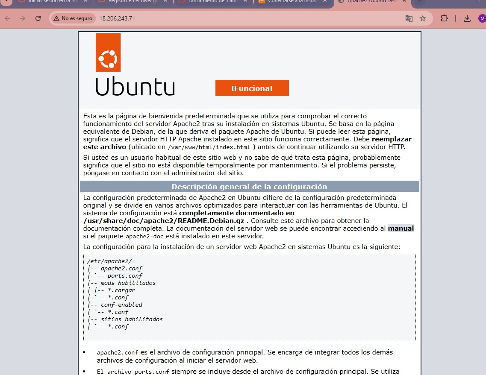

# Computación en la Nube - Proyecto ASIR

---

## 1. Introducción

La computación en la nube (cloud computing) permite disponer de recursos informáticos como servidores, redes y almacenamiento a través de Internet bajo demanda. Este modelo elimina la necesidad de infraestructura física local, facilitando la escalabilidad, la alta disponibilidad y la gestión centralizada. En entornos empresariales, permite desplegar servicios de forma rápida, optimizar costes y mejorar la disponibilidad de los sistemas.

---

## 2. Modelos de servicio

Existen tres modelos principales de computación en la nube:

* **IaaS (Infrastructure as a Service):** proporciona infraestructura básica como máquinas virtuales, redes y almacenamiento. El usuario gestiona el sistema operativo y aplicaciones.
* **PaaS (Platform as a Service):** ofrece un entorno completo de desarrollo sin gestionar la infraestructura.
* **SaaS (Software as a Service):** aplicaciones accesibles vía web sin necesidad de instalación ni mantenimiento.

 En este proyecto se ha utilizado **IaaS**, ya que se ha desplegado y configurado manualmente una máquina virtual.

---

## 3. Proveedor cloud

Se ha utilizado **AWS (Amazon Web Services)** mediante AWS Academy.

AWS es uno de los principales proveedores cloud del mercado y ofrece:

* Infraestructura escalable bajo demanda
* Servicios ampliamente utilizados en entornos empresariales
* Control total sobre las máquinas virtuales mediante EC2
* Redes virtuales seguras mediante VPC

El uso de AWS Academy permite trabajar en un entorno real sin costes, manteniendo características profesionales.

---

## 4. Adaptación del proyecto a la nube

La infraestructura local del proyecto incluye varios servidores y una red segmentada. En la nube, estos elementos se traducen de la siguiente forma:

| Infraestructura local  | En AWS                         |
| ---------------------- | ------------------------------ |
| srv1 (DNS, Samba, SSH) | EC2 Instance                   |
| srv2 (Apache)          | EC2 Instance (Ubuntu + Apache) |
| srv3 (DHCP)            | Servicios de red en VPC        |
| VLANs                  | VPC + Subnets                  |
| Router físico          | Internet Gateway               |
| ACLs                   | Security Groups                |
| Servidor único (SPOF)  | Infraestructura distribuida    |

 En esta práctica se ha implementado una instancia EC2 que representa el servidor web del proyecto.

---

## 5. Arquitectura en la nube

La arquitectura desplegada en AWS se basa en una red virtual (VPC) con una subred pública que permite el acceso desde Internet a una instancia EC2.

Componentes:

* **VPC (10.0.0.0/16):** red privada virtual aislada
* **Subred pública (10.0.1.0/24):** permite acceso desde Internet
* **Internet Gateway:** conexión entre la VPC e Internet
* **EC2 Instance:** servidor Ubuntu con Apache

Seguridad:

* **Security Group configurado:**

  * Puerto 22 (SSH) → acceso remoto a la instancia
  * Puerto 80 (HTTP) → acceso al servidor web

Esta configuración permite exponer un servicio web de forma controlada y segura.

---

## 6. Despliegue práctico

Se ha realizado el despliegue de una máquina virtual en AWS con las siguientes características:

* Nombre: servidor-cloud-asir
* Sistema operativo: Ubuntu Server 22.04
* Tipo de instancia: t3.micro
* Acceso remoto: SSH
* Servicio instalado: Apache2

### Proceso realizado:

1. Creación de instancia EC2
2. Generación de clave SSH
3. Conexión remota a la instancia
4. Instalación del servidor web Apache
5. Verificación del servicio
6. Acceso al servidor web desde navegador

---

## 7. Evidencias (capturas)

### Instancia en ejecución

### Conexión SSH

### Instalación de Apache

### Estado del servicio

### Servidor web funcionando

---

## 8. Ventajas frente al sistema local

* **Eliminación del SPOF:** En la infraestructura local existe un único servidor físico que actúa como punto único de fallo. En AWS, la posibilidad de desplegar múltiples instancias elimina este riesgo.
* **Escalabilidad:** se pueden aumentar recursos (CPU y RAM) de forma inmediata
* **Alta disponibilidad:** posibilidad de replicar servicios en diferentes instancias
* **Acceso remoto:** acceso desde cualquier ubicación mediante SSH
* **Reducción de costes iniciales:** no es necesario adquirir hardware físico

---

## 9. Mejoras futuras

* Implementar balanceador de carga (Elastic Load Balancer)
* Desplegar múltiples instancias para alta disponibilidad
* Automatizar despliegues mediante scripts o herramientas como Terraform
* Configurar copias de seguridad automáticas
* Separar servicios en distintas instancias

---

## 10. Conclusión

La integración de la computación en la nube permite modernizar la infraestructura del proyecto, mejorando su escalabilidad, disponibilidad y accesibilidad. AWS proporciona un entorno profesional donde desplegar servicios reales, permitiendo trasladar la infraestructura local a un modelo flexible y preparado para entornos empresariales.
