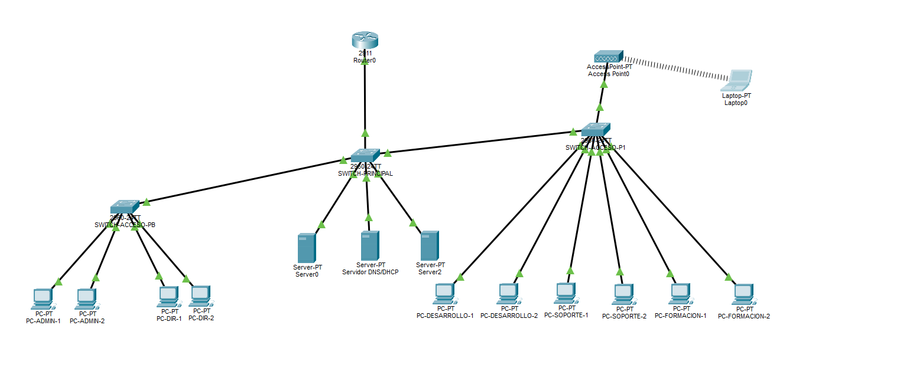
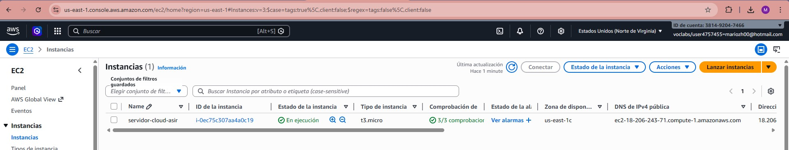

# Portfolio

## Proyecto: Infraestructura IT ASIR

 Repositorio: https://github.com/mariozh97/Proyecto-intermodular-ASIR-

---

## Descripción

Este proyecto consiste en el diseño e implementación de una infraestructura IT para una empresa de desarrollo de software. La idea ha sido montar un entorno completo donde se integran red, sistemas y servicios, simulando una situación real.

---

## Alcance del proyecto

En el proyecto se ha desarrollado:

* Una red segmentada mediante VLANs para separar los distintos departamentos
* Varios servidores Linux con diferentes roles
* Implementación de servicios como Apache, DHCP y DNS
* Despliegue de una máquina virtual en AWS

---

## Otros aspectos del proyecto

Además de la parte de redes, sistemas y cloud, el proyecto también incluye otros módulos trabajados durante el curso:

* **Hardware:** selección y justificación de equipos
* **Bases de datos:** diseño de un modelo relacional y uso de SQL
* **Lenguajes de marcas:** creación de documentación estructurada en XML

Aunque en este portfolio se muestran principalmente evidencias de la parte más técnica, el proyecto completo integra todos estos elementos dentro de una misma infraestructura.

---

## Evidencias del funcionamiento

### Topología de red

Se muestra el diseño completo de la red, incluyendo la segmentación por VLANs y la distribución de los equipos.

---

### Servidor web (Apache)

El servidor web está configurado y accesible desde navegador, lo que confirma su correcto funcionamiento.

---

### Servicio DHCP

El servicio DHCP se encuentra activo, permitiendo la asignación automática de direcciones IP en la red.

---

### Despliegue en AWS

Se ha desplegado una instancia en la nube, lo que añade una parte cloud al proyecto.

---

## Aprendizaje

Este proyecto me ha permitido:

* Entender cómo se diseña una red estructurada
* Configurar servidores y servicios en Linux
* Integrar distintos elementos dentro de una misma infraestructura
* Tener un primer contacto con entornos cloud

---

## Valor del proyecto

Más allá de la parte técnica, este proyecto me ha ayudado a ver cómo se relacionan todos los elementos de una infraestructura IT y a trabajar de forma más organizada, como en un entorno profesional.
